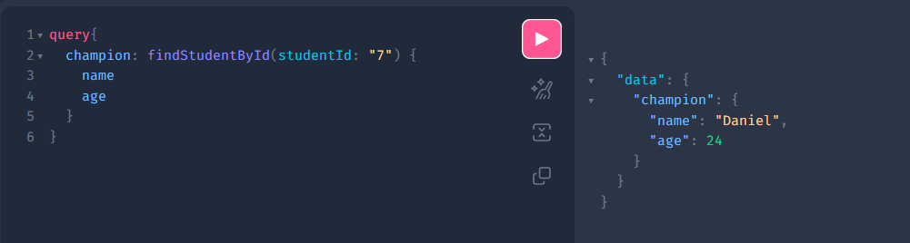
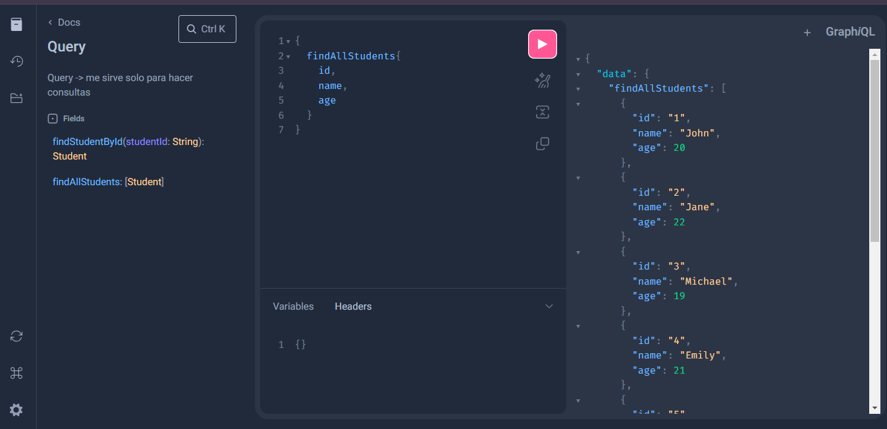
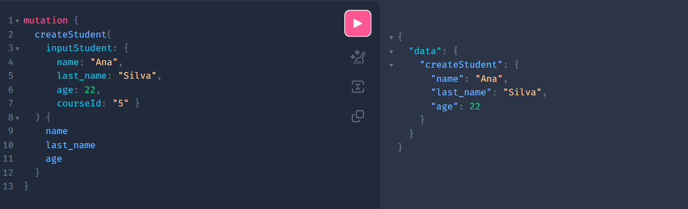
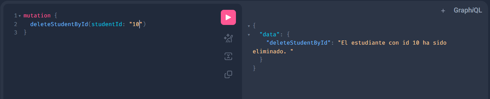
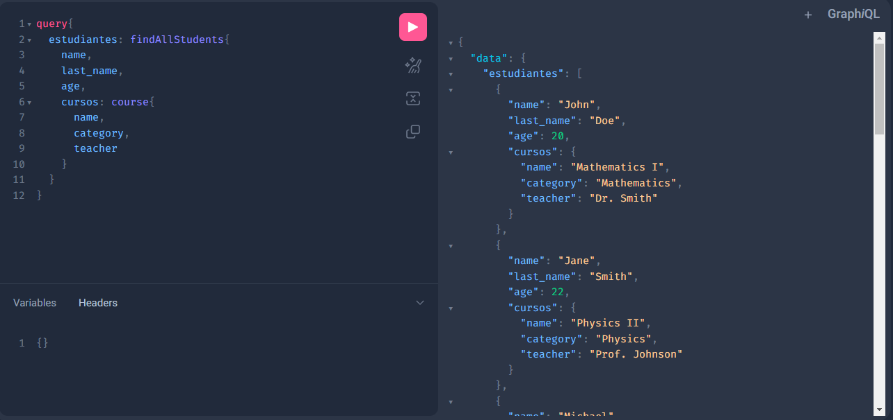

# Dependencias instaladas para este proyecto

- Spring Web
- Lombok
- Spring Boot Dev Tools
- Spring JPA
- MySQL Driver
- Spring for GraphQL

# POM

quitar del pom la dependencia de spring-webflux porque no usaremos programacion reactiva

# Relaciones de este ejemplo

- un alumno solo puede tener 1 curso a la vez
- un curso puede tener varios estudiantes

# rutas

http://localhost:8080/graphiql

traer


listar


crear


eliminar


con relaciones 


# import.sql

en este archivo iran las querys de la BD

# GraphQL

GraphQL es un lenguaje de consultas para una API, usa un sistema de tipos que definen tu información y se ejecuta del
lado del servidor. No está ligado a una base de datos o algún sistema de almacenamiento de la información y en su lugar
es manejado por el código que lo define.

_**Imagina que vas a un restaurante y pides exactamente lo que quieres comer. Si solo quieres pizza, puedes pedir solo
pizza. No tienes que aceptar todo el menú, ¿verdad? Bueno, GraphQL es como ese restaurante. En lugar de obtener toda la
información de una vez (aunque no la necesites), le pides al servidor solo lo que quieres.**_

- **Queries**: Es lo que escribimos para hacer una consulta a un servidor GraphQL donde básicamente seleccionamos
  propiedades o fields de objetos.
- **Fields**: Son propiedades que componen la forma de un tipo de objeto de consulta. Estos se incluyen o excluyen de la
  consulta para definir como queremos que sea la respuesta.
- **Types**: Son un conjunto de fields que componen un tipo de objeto de consulta.

* **Consulta** (Query): Esto es como hacer tu pedido en el restaurante. Dices exactamente lo que quieres y te lo traen.
* **Mutación** (Mutation): Aquí es donde no solo pides datos, sino que también puedes cambiar algo, como añadir un nuevo
  plato al menú.
* **Tipos** (Types): Los datos en GraphQL tienen "tipos". Es como decir que una pizza tiene una forma, ingredientes y un
  tamaño específico. Cada dato tiene un "tipo" para describirlo.

```gql
# Type
type Car {
    model: String!
    manufacturer: String!
}

# Query
{
  toys {
    name
  }
}


# Data resolved
{
  "data": {
    "toys": [
      { "name": "Muñeca" },
      { "name": "Cochecito" },
      { "name": "Robot" }
    ]
  }
}

```

## Scalar Types (Tipos Escalares)

Los tipos escalares son los datos más simples en GraphQL. Son como bloques de construcción básicos, como números o
texto. Los tipos escalares nos permiten manejar datos sencillos que usamos todo el tiempo.

- **Int**: Un número entero (ej: 1, 2, 3).
- **Float**: números con signo y punto flotante
- **String**: secuencia de caracteres UTF-8
- **Boolean**: true o false
- **ID**: Un identificador único, usado para referirse a algo de manera única (ej: 1, abc123)

```gql
{
  toy(id: 1) {
    name
    price
  }
}
```

Aquí, name es un String, price es un Float o Int, y id es un ID.

## Arguments

En GraphQL, los argumentos son como detalles que le damos al servidor para obtener exactamente lo que queremos. Es como
decir: “Quiero una pizza grande con mucho queso”. Aquí, "grande" y "con mucho queso" son argumentos que detallan tu
pedido.

Ejemplo con Argumentos
Si queremos información de un juguete específico, podríamos pedirlo usando su ID como argumento.

```gql
{
  toy(id: 1) {
    name
    price
  }
}
```

¡Vamos a seguir aprendiendo sobre GraphQL de manera sencilla! 🌟

1. Arguments (Argumentos)
   En GraphQL, los argumentos son como detalles que le damos al servidor para obtener exactamente lo que queremos. Es
   como decir: “Quiero una pizza grande con mucho queso”. Aquí, "grande" y "con mucho queso" son argumentos que detallan
   tu pedido.

Ejemplo con Argumentos
Si queremos información de un juguete específico, podríamos pedirlo usando su ID como argumento.

graphql
Copiar código
{
toy(id: 1) {
name
price
}
}
En este caso, id: 1 es el argumento que estamos dando. Le estamos diciendo al servidor: "Dame el juguete con el ID
número 1".

## Aliases

Los alias son como cuando tienes dos amigos llamados "Ana". Para diferenciarlas, las llamas "Ana la Grande" y "Ana la
Pequeña". Un alias te permite cambiar el nombre de los datos para que no haya confusión.

Ejemplo con Alias
Supongamos que quieres ver el nombre de dos juguetes, pero quieres llamarlos de forma diferente.

```gql
{
  car: toy(id: 1) {
    name
  }
  robot: toy(id: 2) {
    name
  }
}
#respuesta
{
  "data": {
    "car": { "name": "Cochecito" },
    "robot": { "name": "Robot" }
  }
}

```

Así los aliases se pueden agregar antes de la consulta y especificar el nombre de la entrada que tendrá. Los alias
también pueden ser usados en fields para renombrar la llave de salida de la información.

## Fragments

Imagina que siempre pides lo mismo en tu restaurante favorito: una pizza con mucho queso y pepperoni. En lugar de
repetir tu pedido completo cada vez, puedes darle al mesero una "nota" donde ya esté todo escrito. ¡Eso es un fragmento
en GraphQL!

Un fragmento te permite reutilizar una parte de una consulta muchas veces. Así no tienes que repetir lo mismo una y otra
vez.

Ejemplo con Fragmentos
Digamos que tienes un juguete y siempre quieres ver su nombre y precio. En lugar de escribir esa información cada vez,
usas un fragmento.

```gql
fragment ToyInfo on Toy {
  name
  price
}

{
  toys {
    ...ToyInfo
  }
}
# respuesta
{
  "data": {
    "toys": [
      { "name": "Muñeca", "price": 10 },
      { "name": "Cochecito", "price": 20 },
      { "name": "Robot", "price": 30 }
    ]
  }
}

```

## Variables

Imagina que en el restaurante te preguntan si quieres tu pizza grande o pequeña. Puedes decidir en ese momento.
Variables en GraphQL te permiten hacer eso: cambias algo en la consulta dependiendo de lo que necesites en el momento.

Ejemplo con Variables
En lugar de escribir el número de identificación del juguete (por ejemplo, id: 1), podemos usar una variable.

```gql
query GetToy($toyId: ID!) {
  toy(id: $toyId) {
    name
    price
  }
}
# Estamos usando una variable llamada $toyId para el ID del juguete. Esta variable se define al hacer la consulta.
# usando la variable
{
  "toyId": 1
}

```

El ! indica que ese campo siempre será obligatorio

El servidor usaría este toyId y te devolvería el juguete con el ID 1.

```json
{
  "data": {
    "toy": {
      "name": "Cochecito",
      "price": 20
    }
  }
}
```

```gql
query CarByManufacturer($manufacturer: String!) {
  car(manufacturer: $manufacturer) {
    model
    manufacturer
  }
}
```

De esta manera al ejecutar la query y enviarle la variable $manufacturer esta pasara como argumento en la consulta y
permitirá hacer un filtrado dinámico de la informacion.

Si necesitaramos obtener siembre aquellos del fabricante ford y solo nissan si es requerido podríamos usar una variable
default.

```gql
query CarByManufacturer($manufacturer: String = "ford") {
  car(manufacturer: $manufacturer) {
    model
    manufacturer
  }
}
```

En caso de no proporcionar la variable por defecto nos regresaría aquellos del fabricante ford.

## Directivas (@include y @skip)

Las directivas como @skip y @include permiten mostrar u omitir partes de la consulta dependiendo de una condición.

@include: Solo muestra algo si una condición es true.

```gql
{
  toy(id: 1) {
    name
    price @include(if: true)
  }
}

# Ejemplo de Respuesta (si if: true):
{
  "data": {
    "toy": {
      "name": "Cochecito",
      "price": 20
    }
  }
}

```

@skip: No muestra algo si una condición es true.

```gql
{
  toy(id: 1) {
    name
    price @skip(if: true)
  }
}
```

Si la condición de @skip es true, el servidor no mostrará el precio.

## Mutations

Las mutaciones son como pedir al servidor que haga cambios en los datos. Por ejemplo, si queremos añadir un nuevo
juguete a nuestra tienda, usamos una mutación. Piensa en las mutaciones como pedir algo extra, como agregar ingredientes
a tu pizza o pedir más juguetes en una tienda.

Ejemplo de Mutación
Vamos a agregar un nuevo juguete llamado "Avión" a nuestra tienda:

```gql
mutation {
  addToy(name: "Avión", price: 25) {
    name
    price
  }
}

# respuesta
{
  "data": {
    "addToy": {
      "name": "Avión",
      "price": 25
    }
  }
}

```

## Object Type Field (Campo de Tipo Objeto)

En GraphQL, los datos pueden ser más complejos que solo texto o números. Los campos de tipo objeto te permiten obtener
datos relacionados. Es como si pidieras no solo tu pizza, sino también una bebida que viene junto con ella.

Ejemplo
Imagina que un juguete tiene un fabricante, que también tiene información propia:

```gql
{
  toy(id: 1) {
    name
    manufacturer {
      name
      location
    }
  }
}
# respuesta
{
  "data": {
    "toy": {
      "name": "Cochecito",
      "manufacturer": {
        "name": "Juguetes Felices",
        "location": "España"
      }
    }
  }
}

```

Aquí, manufacturer es un campo de tipo objeto que tiene sus propios datos (nombre y ubicación).

Cuando se tiene un tipo de dato object se debe especificar en la consulta que fields de ese object se necesitan en la
respuesta.

En una mutation es posible utilizar fields o propiedades de tipo input object que tienen sus propios fields escalares o
de tipo object.

```gql
type Mutation {
productVariantCreate(
productId: ID!

+ variant: VariantInput
  ): Product
  }

+ input VariantInput {
+ title: String!
+ }
```

Para escribir esta consulta nos podemos apoyar de variables de consulta de GraphQL. Estas variables de consulta se
definen en formato JSON en el panel de Query Variables.

Tenemos un endpoint productVariantCreate donde de acuerdo a su definición en el schema requiere que le pasemos como
argumentos el productId y el variant que es un objeto de entrada.

También vamos a utilizar variable de consulta variantToAdd como argumento en la mutation donde se debe especificar su
tipo.

```gql
+ mutation($variantToAdd: VariantInput!) {
  productVariantCreate(
  productId: "product_2"
+     variant: $variantToAdd
  ) {
  title
  variants {
  title
  }
 }
}
```

(Las variables de consulta en GraphQL se escriben como si fueran variables de PHP con el signo dólar al inicio).

## Operaciones Nombradas (Named Operations)

A veces es útil darle un nombre a tu consulta o mutación, especialmente si quieres ejecutarla varias veces o
identificarla fácilmente. Es como ponerle un nombre a tu pedido favorito en el restaurante.

```gql
query GetToyById {
  toy(id: 1) {
    name
    price
  }
}
```

Aquí hemos nombrado la operación como GetToyById. Esto es útil para saber qué hace esta consulta específica.

## Tipos de GraphQL

- Scalar Types: Datos básicos como números, texto o booleanos.
- Object Types: Datos más complejos que agrupan varios campos.
- Enum Types: Conjuntos de valores predefinidos.
- Input Types: Tipos especiales usados para pasar datos en mutaciones.
- List Types: Conjuntos de elementos del mismo tipo.
- Union Types: Campos que pueden devolver diferentes tipos de objetos.
- Interface Types: Conjunto de campos que otros tipos de objeto deben implementar.
- Non-null Types: Tipos que no permiten valores null.

### Enum Types (Tipos enumerados)

Un tipo enumerado (enum) define un conjunto de valores posibles para un campo. Esto es útil cuando un campo solo puede
tener algunos valores específicos, como una lista de categorías o estados.

Ejemplo de tipo enumerado:

```gql
enum ToyCategory {
  ACTION_FIGURE
  BOARD_GAME
  PLUSH
}

type Toy {
  id: ID!
  name: String!
  category: ToyCategory!
}
```

En este ejemplo, el campo category solo puede ser uno de los valores de ToyCategory (ACTION_FIGURE, BOARD_GAME, o
PLUSH).

### Input Types (Tipos de entrada)

Los tipos de entrada se utilizan en las mutaciones para enviar datos al servidor. A diferencia de los tipos de objeto,
los tipos de entrada no pueden contener campos que sean otros tipos de objeto; solo pueden contener tipos escalares o
listas.

Ejemplo de tipo de entrada:

```gql
input AddToyInput {
  name: String!
  price: Float!
  category: ToyCategory!
}

mutation {
  addToy(input: { name: "Muñeca", price: 15, category: PLUSH }) {
    id
    name
  }
}
```

En este ejemplo, el tipo de entrada AddToyInput se utiliza en la mutación para agregar un nuevo juguete.

### List Types (Tipos de lista)

Un tipo de lista es un conjunto de elementos del mismo tipo. Puedes tener listas de tipos escalares o listas de tipos de
objeto. En GraphQL, las listas se representan con corchetes [].

Ejemplo de tipo de lista:

```gql
type Query {
  toys: [Toy!]!
}
```

Aquí, el campo toys devolverá una lista de objetos Toy. El ! después del tipo indica que la lista no puede ser null, y
que cada juguete dentro de la lista también debe ser válido (no null).

### Union Types (Tipos de unión)

Los tipos de unión permiten que un campo devuelva uno de varios tipos de objeto. A diferencia de los interfaces, los
tipos de unión no necesitan compartir campos en común.

Ejemplo de tipo de unión:

```gql
union SearchResult = Toy | Manufacturer

type Query {
  search(query: String!): [SearchResult!]!
}
```

En este caso, el campo search puede devolver una lista que contenga objetos del tipo Toy o Manufacturer.

### Interface Types (Tipos de interfaz)

Una interfaz define un conjunto de campos que un tipo de objeto debe implementar. Las interfaces permiten que diferentes
tipos de objetos compartan campos comunes.

Ejemplo de interfaz:

```gql
interface Product {
  id: ID!
  name: String!
}

type Toy implements Product {
  id: ID!
  name: String!
  price: Float
}

type Book implements Product {
  id: ID!
  name: String!
  author: String!
}
```

En este ejemplo, tanto Toy como Book implementan la interfaz Product, por lo que deben tener los campos id y name.

### Non-null Types (Tipos no nulos)

Los tipos no nulos son tipos que no pueden tener un valor null. Esto se indica añadiendo un signo de exclamación (!) al
final del tipo. En GraphQL, los campos son null por defecto, a menos que se especifique que son non-null.

Ejemplo:

```gql
type Toy {
  id: ID!
  name: String!
  price: Float!
}
```

Aquí, id, name, y price no pueden ser null.
